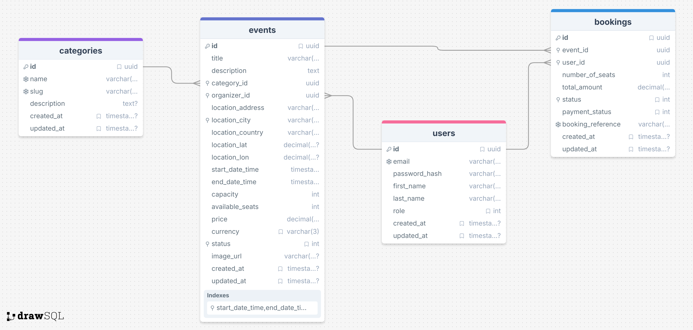

# Event Booking Platform - Backend

This folder contains the FastAPI backend for the Event Booking Platform. The backend exposes a robust, versioned REST API.

## Folder Structure

```text
backend/
├── alembic/              # Database migration scripts and configurations
├── app/                  # Main application package
│   ├── api/              # API router definitions and endpoints
│   ├── core/             # Core configurations (security, settings, CORS)
│   ├── db/               # Database connection and session management
│   ├── models/           # SQLAlchemy database models
│   ├── schemas/          # Pydantic schemas for data validation and serialization
│   ├── services/         # Business logic and use cases
│   └── main.py           # FastAPI application factory and entry point
├── scripts/              # Helper shell/python scripts
├── tests/                # Automated test suite routines
├── Dockerfile            # Container build definition
├── requirements.txt      # Python dependencies
└── alembic.ini           # Alembic configuration
```

## API Endpoints

The API is structured to fulfill modern application requirements spanning various domain entities:

- **Authentication:** Token provision, user registration (`/api/auth/register`), login (`/api/auth/login`), and current user profile (`/api/auth/me`).
- **Events:** Comprehensive searching, filtering, pagination, and endpoints for organizers to maintain their events.
- **Bookings:** Ticket purchases, cancellation workflows with availability checks, and user booking histories.
- **Categories:** Managing generic platform categories.
- **Organizer Features:** Specialized endpoints to view event performance, attendees, and related analytics.

### Swagger API Docs

Interactive API documentation strictly following the `task-docs/swagger.yaml` structure is automatically served by FastAPI. It supports inline token-based authentication testing.

Once the backend is running, the documentation is located at:

- **URL**: [http://localhost:8000/api/v1/docs](http://localhost:8000/api/v1/docs)

## Database Schema

We use PostgreSQL for persistence. Below is the Entity Relationship Diagram (ERD).



## Implementation Status

Based on the requested assessment parameters in `task-docs/README.md`, here's a rough overview of implemented functionalities:

### ✅ Finished Tasks

- User registration and login mechanics (JWT secured over HttpOnly cookies).
- Role-based API access barriers (User, Organizer, Admin paradigms).
- CRUD operations for events enforced via authorization.
- Advanced event filtering and search (by date, location, category, and price range).
- Booking creation paired with immediate database seat validation.
- User visibility over their own bookings, including cancellation logic that accurately replenishes seats.
- Organizer dashboards to evaluate their events and track bookings.
- Interactive map ghost integrations (Leaflet coordinates).
- Comprehensive Docker setup paired with functional CI pipelines.

### ❌ Remaining / Not Implemented Features

- A fully blown Administrative dashboard (management of all user profiles and platform telemetry).
- Email notifications upon successful bookings.
- Exporting bookings/attendees into bulk CSV files.
- Dedicated Event reviews and ratings endpoints.
- Integration of a background job queue for async processing.

## How to Run the Backend

### Normal Local Setup

If developing directly without Docker, verify you have Python 3.10+ and an active local PostgreSQL server.

```bash
cd backend

# Create and activate a virtual environment
python -m venv venv
source venv/bin/activate  # On Windows: venv\Scripts\activate

# Install dependencies
pip install -r requirements.txt

# Environment Setup
cp .env.example .env
# Important: Update .env with your local PostgreSQL database credentials

# Run database migrations
alembic upgrade head

# Start the application server
uvicorn app.main:app --host 0.0.0.0 --port 8000 --reload
```

### Running with Docker Containers

Running the backend as part of the containerized stack is easy and robust. The `docker-compose.yml` ensures all environment variables are correctly mapped between containers.

From the repository root:

```bash
docker-compose up backend db -d
```

When running inside Docker, the `command` defined in docker-compose automatically resolves dependencies, triggers the `alembic upgrade head` migrations, and launches the server. Access the service at [http://localhost:8000/api/v1](http://localhost:8000/api/v1).
